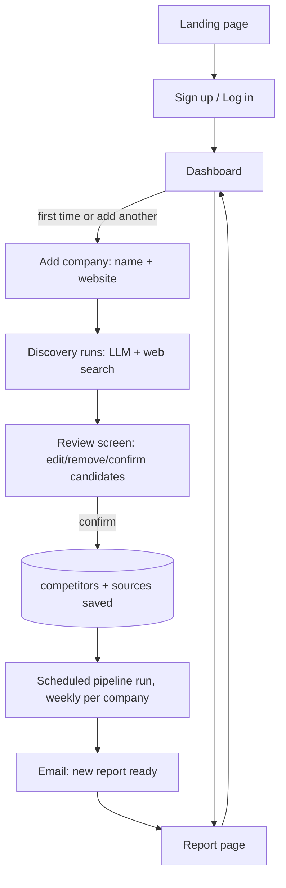

# Founder's Radar v2 — Plan, User Workflow & Page Map

This document consolidates the v2 (multi-tenant product) plan into one reference: the phased build plan, the end-to-end user workflow, and the full list of frontend pages/screens with a count. It supersedes nothing in `docs/00-overview.md` through `docs/08-infra-scheduling.md` — those describe the v1 pipeline, which v2 builds on top of, not replaces.

Full working notes and open engineering decisions live in `docs/decisions.md`; this file is the user-facing plan summary.

---

## 1. Plan

Four phases, ordered to de-risk the hardest and least certain part (AI-driven competitor discovery) by shipping the boring, safe parts first — the same instinct that shaped v1 ("do ComplyDo first to visualize the product, then expand").

**Confirmed decisions for v2:**
- **Discovery is human-in-the-loop, not autonomous.** The user reviews and edits AI-suggested competitors/sources before anything is tracked. v1 hit real cases (a Cloudflare-blocked careers page, a competitor with no dedicated changelog) that blind automation would have silently turned into broken or empty reports.
- **Delivery is a web dashboard + email notification**, not PDF-only. This resolves the "PDF vs web vs both" question left open since the v1 build.

### Phase 1 — Multi-tenancy foundation
Same pipeline, but any logged-in user can create their own tracked company and manually add competitors/sources through the UI — a self-serve version of what `backend/db/seed.py` does by hand today for ComplyDo. No AI discovery yet.
- Supabase Auth (already on Supabase for the DB — no new vendor).
- `owner_id` added to `target_companies`; real per-owner Row Level Security policies replace the public-read policies added for the single-user v1 portfolio case.
- A `status` field on `sources` (`active` / `broken` / `needs_review`) so scraping failures (like the Drata careers-page block hit in v1) surface in the UI instead of only in logs.
- Cloud Function scheduler changes from "one hardcoded company" to "loop over all active companies," with per-company error isolation.

### Phase 2 — Auto-discovery (human-in-the-loop)
Replaces the manual "add competitors/sources" form with an assisted flow: user types a company name, the system proposes competitors and source URLs (pricing/feature/jobs/news pages), user reviews and edits before confirming.
- New `backend/discovery/` pipeline stage: LLM (Groq, same as today) + Tavily's Search API for web search (**resolved** — Brave Search was the original recommendation but requires a credit card even on its free tier; Tavily's free tier is genuinely cardless, 1,000 requests/month, and is purpose-built for this "agent does a search, gets structured results" use case).
- Nothing is saved to the database until the user confirms the reviewed list.

### Phase 3 — Scale + delivery
The parts that only matter once more than one or two companies are being tracked.
- Broken-source status (from Phase 1) surfaced visibly in the dashboard.
- Re-check scraping rate limits and Groq/embedding cost at real scale — v1's collectors were only tuned for 2 competitors × 4 source types.
- Email notifications on new reports — needs an email provider, **not yet chosen** (Resend or Postmark, both viable).
- Companies staggered across the week rather than all running at once.

### Phase 4 — Monetization (optional, deferred)
Not designed in detail — contingent on Phases 1–3 actually working for real users. Would add Stripe billing, plan-based tracking limits, and pause/cancel tied to company status.

### Still-open decisions
1. Email provider (Phase 3) — Resend vs. Postmark, not yet confirmed.
2. Whether Phase 1 ships for real public signups (needs production auth hardening — email verification, password reset) or stays a local/portfolio demo.

---

## 2. User workflow

End-to-end journey once Phases 1–3 are built:

1. **Land** on the marketing page, click sign up.
2. **Sign up / log in** (Supabase Auth — email/password or magic link).
3. **Land on the dashboard** — empty state on first login ("track your first competitor set").
4. **Add a company**: type the company name (and optionally its website).
5. **Review discovery results**: the system proposes competitors and their pricing/feature/jobs/news source URLs; user edits, removes, or adds entries.
6. **Confirm** — this is the point data is actually written (`target_companies` / `competitors` / `sources` rows created).
7. **Pipeline runs on schedule** (weekly, per company) — collects, detects changes, analyzes, scores, assembles a report. No user action needed here; this is the existing v1 pipeline (`backend/main.py`) run per-tenant.
8. **Email notification** arrives when a new report is ready, linking to the dashboard.
9. **View the report** on the web (existing `/report/[id]` page, reused from v1) — headline, executive summary, signal cards.
10. **Return to the dashboard** anytime to see report history, add another company, or check for `needs_review` source warnings.

---

## 3. Frontend page map

v1 today has exactly **one** real page (`frontend/app/report/[id]/page.tsx`) plus a shared layout — there is no landing page, login, or dashboard yet.

| # | Route | Purpose | Status |
|---|-------|---------|--------|
| 1 | `/` | Landing / marketing page | New |
| 2 | `/login` | Log in | New |
| 3 | `/signup` | Sign up | New |
| 4 | `/dashboard` | List of the user's tracked companies + report history | New |
| 5 | `/company/new` (step 1) | Enter company name/website to start discovery | New |
| 6 | `/company/new` (step 2) | Review/edit/confirm discovered competitors & sources | New (same route, wizard step) |
| 7 | `/company/[id]` | Company detail: report history, manage sources, `needs_review` warnings | New |
| 8 | `/report/[id]` | Individual report view (headline, summary, signal cards) | **Existing**, reused as-is |
| 9 | `/settings` | Account settings, email notification preference | New |

**Core product (Phases 1–3): 8 distinct routes, 9 screens** counting the two-step add-company wizard as two screens on one route.

**Phase 4 (optional, deferred)** adds one more:

| # | Route | Purpose | Status |
|---|-------|---------|--------|
| 10 | `/billing` | Plan/subscription management | New, deferred to Phase 4 |

If Phase 4 is built: **9 routes, 10 screens** total.

---

*Plan approved 2026-09-04. Full phase detail with file-level notes lives in the plan file this was generated from; this document is the durable, repo-committed version of it.*
